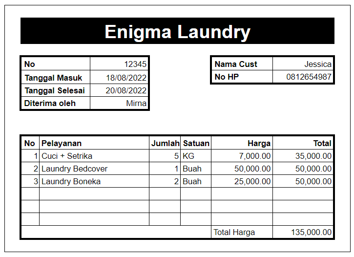
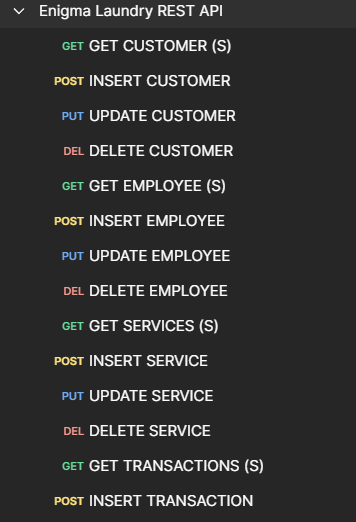
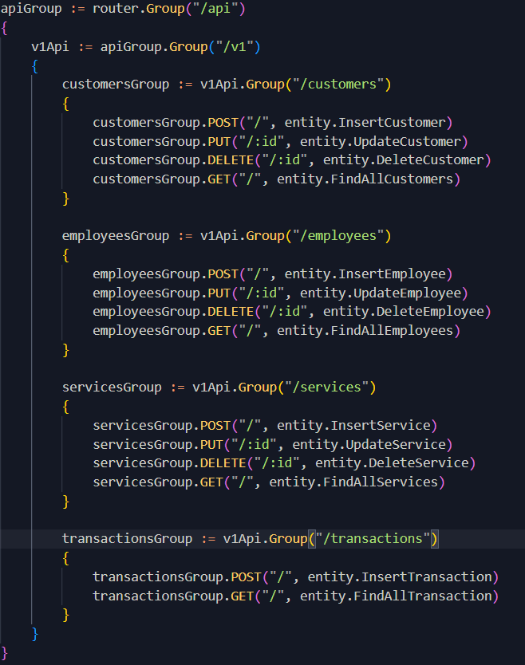

# Aplikasi Enigma Laundry

## Deskripsi

Setelah menyelesaikan pembelajaran tentang Go API, Saya ditugaskan oleh manajemen Enigma Laundry (EL) untuk membuat sebuah aplikasi sederhana berbasis API untuk mencatat transaksi di tokonya.



Fitur-fitur yang diminta oleh manajemen EL adalah:

1.  Struktur/Design Database yang memenuhi kaidah normalisasi berdasarkan nota dibawah ini dengan kriteria sbb :

        - Hasil design dalam bentuk file Script DDL Postgre SQL
        - Design database minimal memiliki 2 tabel master dan 1 tabel transaksi
        - Sediakan sample data dalam bentuk Script DML Postgre SQL

2.  Aplikasi berbasis API menggunakan bahasa pemrograman Golang dengan kriteria sbb :

        - Aplikasi memiliki fitur untuk melakukan GET, POST, PUT, dan DELETE pada tabel master
          1. Manajemen Customer
          2. Manajemen Produk
          3. Manajemen Employee
        - Aplikasi memiliki fitur untuk melakukan GET dan POST pada table Transaksi
          1. Manajemen Transaksi
        - Setiap fitur master wajib memiliki minimal 2 jenis validasi yang berbeda
        - Setiap transaksi master wajib memiliki minimal 4 jenis validasi yang berbeda

3.  Dokumentasi cara menjalankan aplikasi dan penggunaan aplikasi dalam bentuk readme.md atau dokumen ektensi word atau pdf

---

## Instalation

Clone or download this repo to your local directory.

## Usage

1. Import DDL.sql on folder psql to your database.
2. Configure your db connection on config/config.go

```go
// Database Config
const (
	host     = ""   // Your connection hostname
	port     =      // Your connection port
	user     = ""   // Your connection username
	password = ""   // Your connection password
	dbname   = "enigma_laundry"
)
```

3. Open terminal on your program local directory.

```go
go run .
```

4. API Collection available on ./asset/Enigma Laundry REST API.postman_collection.json

## API Spec

### Customer API

#### Create Customer

Request :

- Method : `POST`
- Endpoint : `/customers`
- Header :
  - Content-Type : application/json
  - Accept : application/json
- Body :

```json
{
  "name": "string",
  "phoneNumber": "string",
  "address": "string"
}
```

Response :

- Status : 201 Created
- Body :

```json
{
  "message": "string",
  "data": {
    "id": "string",
    "name": "string",
    "phoneNumber": "string",
    "address": "string"
  }
}
```

#### List Customer

Request :

- Method : GET
- Endpoint : `/customers`
  - Header :
  - Accept : application/json
- Query Param :
  - name : string `optional`,

Response :

- Status Code : 200 OK
- Body:

```json
{
  "message": "string",
  "data": [
    {
      "id": "string",
      "name": "string",
      "phoneNumber": "string",
      "address": "string"
    },
    {
      "id": "string",
      "name": "string",
      "phoneNumber": "string",
      "address": "string"
    }
  ]
}
```

#### Update Customer

Request :

- Method : PUT
- Endpoint : `/customers/:id`
- Header :
  - Content-Type : application/json
  - Accept : application/json
- Body :

```json
{
  "name": "string",
  "phoneNumber": "string",
  "address": "string"
}
```

Response :

- Status : 200 OK
- Body :

```json
{
  "message": "string",
  "data": {
    "id": "string",
    "name": "string",
    "phoneNumber": "string",
    "address": "string"
  }
}
```

#### Delete Customer

Request :

- Method : DELETE
- Endpoint : `/customers/:id`
- Header :
  - Accept : application/json
- Body :

Response :

- Status : 200 OK
- Body :

```json
{
  "message": "string"
}
```

### Service API

#### Create Service

Request :

- Method : POST
- Endpoint : `/services`
- Header :
  - Content-Type : application/json
  - Accept : application/json
- Body :

```json
{
	"name": "string",
  "price": int,
  "unit": "string" (satuan product,cth: Buah atau Kg)
}
```

Response :

- Status Code: 201 Created
- Body:

```json
{
	"message": "string",
	"data": {
		"id": "string",
		"name": "string",
		"price": int,
		"unit": "string" (satuan product,cth: Buah atau Kg)
	}
}
```

#### List Service

Request :

- Method : GET
- Endpoint : `/services`
  - Header :
  - Accept : application/json
- Query Param :
  - name : string `optional`,

Response :

- Status Code : 200 OK
- Body:

```json
{
	"message": "string",
	"data": [
		{
			"id": "string",
			"name": "string",
			"price": int,
			"unit": "string" (satuan product,cth: Buah atau Kg)
		},
		{
			"id": "string",
			"name": "string",
			"price": int,
			"unit": "string" (satuan product,cth: Buah atau Kg)
		}
	]
}
```

#### Update Service

Request :

- Method : PUT
- Endpoint : `/services/:id`
- Header :
  - Content-Type : application/json
  - Accept : application/json
- Body :

```json
{
	"name": "string",
	"price": int,
	"unit": "string" (satuan product,cth: Buah atau Kg)
}
```

Response :

- Status Code: 200 OK
- Body :

```json
{
	"message": "string",
	"data": {
		"id": "string",
		"name": "string",
		"price": int,
		"unit": "string" (satuan product,cth: Buah atau Kg)
	}
}
```

#### Delete Service

Request :

- Method : DELETE
- Endpoint : `/services/:id`
- Header :
  - Accept : application/json
- Body :

Response :

- Status : 200 OK
- Body :

```json
{
  "message": "string"
}
```

### Employee API

#### Create Employee

Request :

- Method : POST
- Endpoint : `/employees`
- Header :
  - Content-Type : application/json
  - Accept : application/json
- Body :

```json
{
	"id": int,
  "employeeName": "string",
  "dateCreated": "yyyy-mm-ddThh:mm:ssZ"
}
```

Response :

- Status Code: 201 Created
- Body:

```json
{
	"message": "string",
	"data": {
		"id": int,
    "employeeName": "string",
    "dateCreated": "yyyy-mm-ddThh:mm:ssZ"
	}
}
```

#### List Employee

Request :

- Method : GET
- Endpoint : `/employees`
  - Header :
  - Accept : application/json
- Query Param :
  - name : string `optional`,

Response :

- Status Code : 200 OK
- Body:

```json
{
	"message": "string",
	"data": [
		{
			"id": int,
      "employeeName": "string",
      "dateCreated": "yyyy-mm-ddThh:mm:ssZ"
		},
		{
			"id": int,
      "employeeName": "string",
      "dateCreated": "yyyy-mm-ddThh:mm:ssZ"
		}
	]
}
```

#### Update Employee

Request :

- Method : PUT
- Endpoint : `/employees/:id`
- Header :
  - Content-Type : application/json
  - Accept : application/json
- Body :

```json
{
	  "id": int,
    "employeeName": "string",
    "dateCreated": "yyyy-mm-ddThh:mm:ssZ"
}
```

Response :

- Status Code: 200 OK
- Body :

```json
{
	"message": "string",
	"data": {
		"id": int,
    "employeeName": "string",
    "dateCreated": "yyyy-mm-ddThh:mm:ssZ"
	}
}
```

#### Delete Employee

Request :

- Method : DELETE
- Endpoint : `/employees/:id`
- Header :
  - Accept : application/json
- Body :

Response :

- Status : 200 OK
- Body :

```json
{
  "message": "string"
}
```

### Transaction API

#### Create Transaction

Request :

- Method : POST
- Endpoint : `/transactions`
- Header :
  - Content-Type : application/json
  - Accept : application/json
- Body :

```json
{
  "id": int,
  "idEmployee": int,
  "idCustomer": int,
  "idService": int,
  "amount": int,
  "transactionIn": "yyyy-mm-ddThh:mm:ssZ",
  "transactionOut": "yyyy-mm-ddThh:mm:ssZ"
}
```

Request :

- Status Code: 201 Created
- Body :

```json
{
	"message": "string",
	"data":  {
		"id": int,
    "idEmployee": int,
    "idCustomer": int,
    "idService": int,
    "amount": int,
    "transactionIn": "yyyy-mm-ddThh:mm:ssZ",
    "transactionOut": "yyyy-mm-ddThh:mm:ssZ"
	}
}
```

#### List Transaction

Request :

- Method : GET
- Endpoint : `/transactions`
- Header :
  - Accept : application/json
- Query Param :
  - id : int `optional`,
- Body :

Response :

- Status Code: 200 OK
- Body :

```json
{
	"message": "string",
  "data": [
    {
     "id": int,
    "idEmployee": int,
    "idCustomer": int,
    "idService": int,
    "amount": int,
    "transactionIn": "yyyy-mm-ddThh:mm:ssZ",
    "transactionOut": "yyyy-mm-ddThh:mm:ssZ"
    }
  ]
}
```

## Screenshots

1. Api Collection



2. Available Endpoint


